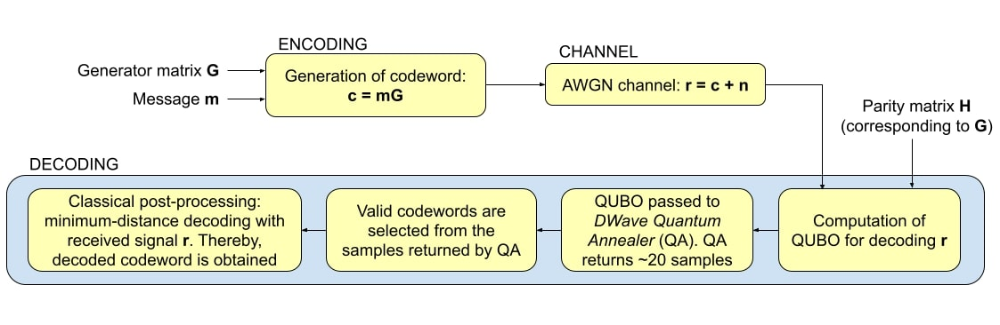

# Quantum-Assisted LDPC Decoding Augmented with Classical Post-Processing for AWGN Channels

## Abstract
Utilizing present and futuristic Quantum Computers to solve difficult problems in different domains has become one of the main endeavors at this moment. Of course, in arriving at the requisite solution both quantum and classical computers work in conjunction. With the continued popularity of Low Density Parity Check (LDPC) codes and hence their decoding, this paper looks into the latter as a Quadratic Unconstrained Binary Optimization (QUBO) and utilized D-Wave 2000Q Quantum Annealer to solve it. The outputs from the Annealer are classically postprocessed using simple minimum distance decoding to further improve the performance. We evaluated and compared this implementation against the decoding performance obtained using Simulated Annealing (SA) and belief propagation (BP) decoding with classical computers. The results show that implementations of annealing (both simulated and quantum) are superior to BP decoding and suggest that the advantage becomes more prominent as block lengths increase. Reduced Bit Error Rate (BER) and Frame Error Rate (FER) are observed for simulated annealing and quantum annealing, at useful SNR range - a trend that persists for various codeword lengths.

## Model Explanation

## Results
.jpg)
.jpg)

## Conclusion and Future Plans

## Reference
Please refer to our conference preprint at https://arxiv.org/abs/2204.09940
